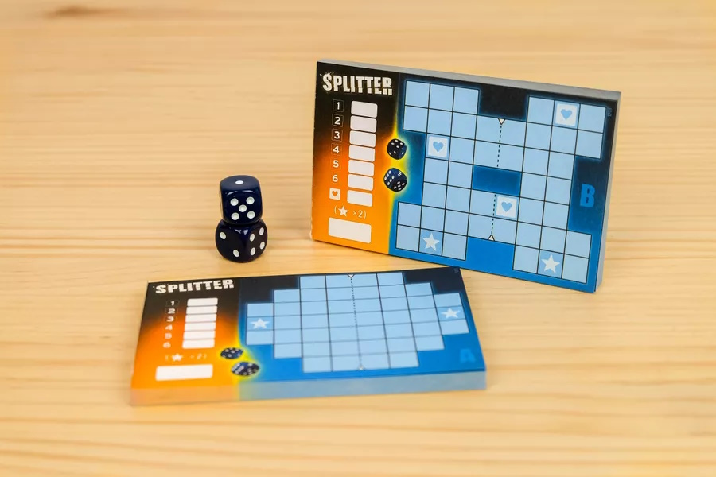

# Splitter

In Splitter, you must group numbers together to score points — two 2s, three 3s, and so on — but you're placing two numbers at a time, so things won't always work out.



You get a score sheet with 44 empty spaces on it. You can expect  two different patterns of spaces (see the image); Both patterns have a dashed line through the middle that splits it into two mirrored halves. This mirroring is why we call this game 'splitter'.


On a turn, the computer rolls two six-sided dice. You then write the results, e.g. 1 and 4, in empty spaces in the provided pattern, with each number being in the mirrored space of the other. If, say, you place the 1 in the leftmost space of the top row, then you must place the 4 in the rightmost space of the top row. The position you choose on the left side of the split also determines the position where to put you other number on the right side of the split.

After 22 dice rolls, your pattern will be filled. Each 1 on its own — that is, with no other 1s orthogonally adjacent — scores 1 point; each set of two 2s that have no other orthogonally adjacent 2s score 2 points; and so on up to a set of six 6s with no other orthogonally adjacent 6s being worth 6 points. 

There are two special cases: 
A starred space is present on each half of the pattern, and a scored group that contains this starred space has its points doubled. 
The other board has a pattern which has a set of three spaces with hearts, and if you fill all three hearts with the same number, you score 5 points.)

## Digital sheet
On the first move, we provide you with a digital version of the sheet, the meaning of the numbers in this sheet are =>
- 0 = NOT FILLABLE ; Ignore this space. It's not fillable.
- 1 = EMPTY ; Here you can put a dice number.
- 2 = STAR  ; same as 1, but a potential score will be doubled.
- 3 = HEART ; same as 1, but you can get 5 extra points if all hearts have the same number in the final round. 

### Extra clarification of the rules:

- Each round you must place 2 numbers based on the numbers from the dice, but in mirrored position
- You can choose where to place one number on the left side of the grid and the other will be mirrored to the other side
- If you get 4 connecting 4's you get 4 points, 5 connecting 5's you get 5 points, and so on.
- You need the EXACT number of connections if you get more or less than the number you will get no points
- A bonus space is present on each half of the pattern, and a scored group that contains this starred space has its points doubled

## Example


In this example you will get 3 points
2 2's are connected giving 2 point
1 1 is connected also giving 1 point

There are too many connected 4's on the board to give a point for that and theres to little connected 6's on the board for those to give a point

You can also [watch this youtube video](https://www.youtube.com/watch?v=o74s0IYA3B0) for a simple guide on how its played

A example implementation can also be found in the Source/Example directory of this repo

## Details

The top left corner has the coordinate (0,0). The X coordinate increases to the right, the Y to the bottom.

### Input Data

1. When your program first runs via the Tester it will send a line with the sizes of the grid <width> <height> <rounds>
2. Then it will send the entire grid
3. The first dice
4. You cannot place numbers on 0's

After that you send the response back in the following format

p <number> <x>,<y>

Heres a example loop:

```
8 7 22
1 1 1 0 0 1 3 1
1 1 1 1 1 1 1 1
0 3 1 1 1 1 1 0
0 1 1 0 0 1 1 0
0 1 1 1 3 1 1 0
1 1 1 1 1 1 1 1
1 2 1 0 0 1 2 1
d 6 1
p 6 2,3
d 3 4
p 3 2,4
d 6 1
p 6 1,1
d 3 6
p 3 1,5
d 6 4
p 6 0,5
d 3 3
p 3 1,3
d 2 5
p 2 1,2
d 3 1
p 3 0,6
d 1 1
p 1 3,5
d 1 6
p 1 1,4
d 1 1
p 1 3,1
d 1 2
p 1 2,1
d 4 3
p 4 0,0
d 6 3
p 6 3,4
d 5 2
p 5 1,6
d 6 6
p 6 0,1
d 5 4
p 5 2,2
d 4 5
p 4 3,2
d 5 5
p 5 2,6
d 1 2
p 1 2,5
d 3 4
p 3 2,0
d 2 3
p 2 1,0
```

The only thing you have to send is the p's the rest is what you recieve excep for the last p


### Testing

Theres a exe in the releases panel of this repo you can use to test the program as follows `./Tester.exe "commands to execute" <games>` so for example `./Tester.exe "node bot.js" 20`

### Complex

Your solution can be as simple as taking a random number or as complex as taking into account the bonus fields (2) and more
