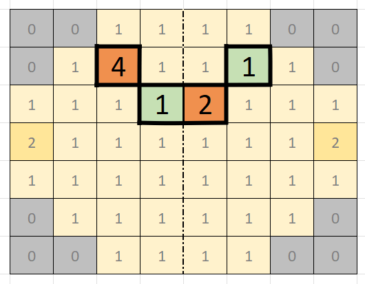
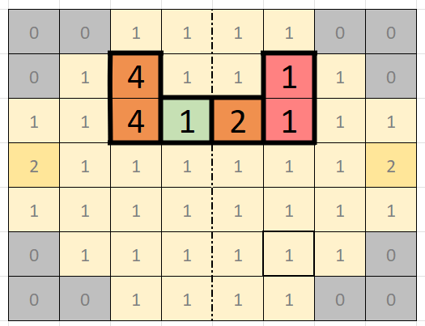
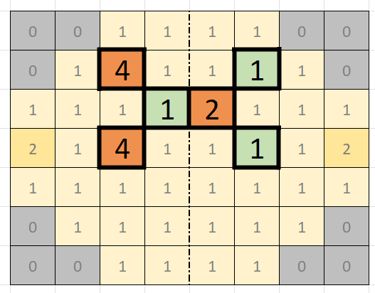
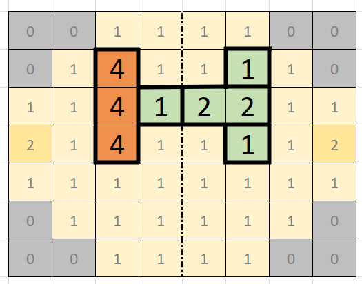
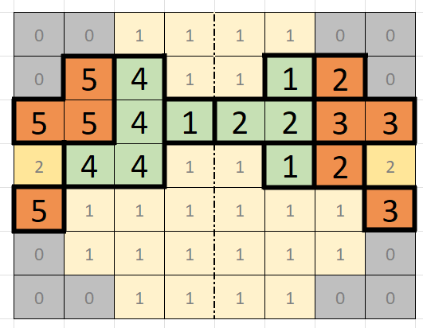
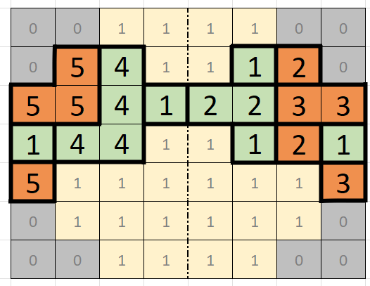
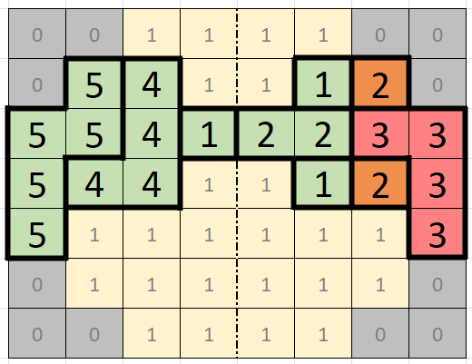
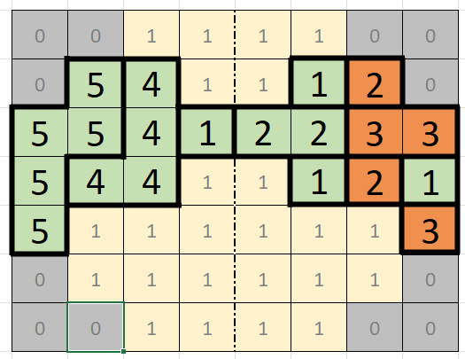

# Move examples
To give you more of an idea of how to play the game we've selected a couple of situations you could encounter while playing the game. In the examples, every space is colored to define its worth to the user. Orange means we don't have a large enough chain to score points (yet). Red means the chain has become too large. Green means the chain currently scores points. Grey spaces are unfillable spaces, they are not part of the board (a 0 in the digital sheet). Light yellow is reserved for defining basic EMPTY spaces (a 1 in the digital sheet). A slightly darker yellow is used for the STAR spaces (a 2 in the digital sheet).

> [!TIP]
> The yellow colored squares only define layout, in other words, they show spaces where no numbers have been placed yet. 

## Basic chaining

For this example we continue the example loop as found in [GAME.md's input data section](GAME.md#input-data)
```
# 8 7 22   // width height and number of rounds. will not change during this competition.
# 0 0 1 1 1 1 0 0
# 0 1 1 1 1 1 1 0
# 1 1 1 1 1 1 1 1
# 2 1 1 1 1 1 1 2
# 1 1 1 1 1 1 1 1
# 0 1 1 1 1 1 1 0
# 0 0 1 1 1 1 0 0
# 4 1      // you get a dice roll of 4 and 1.
4 2 1      // place the dice with value 4 on position 2,1 ; the dice with value 1 will be mirrored automaticly.
# 1 2      // etc. etc.
1 3 2 
# 1 2      // dice roll of 1 and 2
1 3 2	   // place it at 3,2
# 1 4 	   // now we roll 4 and 1, let's have a quick look at the board:
```


 
We see that we currently have a four on the board, and we also just rolled a four, we have a chance to chain them! However, let's take a look at what happens if we do so:
 

 
we would put a 1 next to another 1, that's not good, it will ensure we don't get points for those! For now we'll take a bet, placing the 4 so that a chain might become available if we get another 4, but so we don't chain that 1.
 

 
```
4 2 3 // Place the 4 two spots below the existing 4, the 1 that's mirrored won't chain the other 1 that way
# 2 4 // Our (very short term) patience is rewarded, we roll a better combination! Have a look:
```
We can place the four to chain the two we already had and we can place the 2 to create a chain of two 2s.
 

 
So we respond with

```
4 2 2 // Place it in the coordinates 2,2
```

## Chaining with the STAR space

The game has progressed further and this is the current board.



The special spots on this board (which give us double the points acquired there) have been fully surrounded by other numbers. Let's look at a couple of possible rolls that would give us points.

<br><br>

```
# 1 1
```

This dice roll would give us a total of 4 points (both 1s would be unchained so both give 1 point, however since its the special spot the score is doubled for both).



<br><br>

```
# 5 3
```
If we roll a 5 and a 3 we can place the 5 in the left special spot, it would make a chain of 5s on the left. On the right it would lead to four 3s chained together. That is too many so it would not give us any points, our total point gain for this roll would be 10 (5 for the chain and we get to double them thanks to the special spot).



<br><br>

```
# 1 5
```

This roll would give us the most points possible, 12. Placing the 5 left we get 10 points as explained at the previous roll (5 for the chain, doubled). Placing the 1 right we get 2 points as explained at the first roll (1 as its isolated, doubled).


